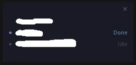

# Claude Code Monitor

Always-on-top overlay widget that shows the live status of every Claude Code **and Codex CLI** session running on your machine.

Built with Claude Code and Codex CLI, for personal use. Tested on Windows; other platforms work in part but aren't a focus.



## What it shows

Each row is one Claude Code or Codex session: a provider marker (`●` Claude, `◆` Codex), state colour, the project folder + slot number, a short topic summary, and the state label.

| State | Meaning |
|---|---|
| Working | Claude is generating or running a tool |
| Done | Response finished |
| Waiting | Claude is asking you a question |
| Interrupted | Stopped via ESC or error |
| Idle | Session open, no activity |

Click a row to focus that terminal. Drag the bar to move the widget; the position is remembered.

## How the summary is generated

The topic label in each row is generated automatically when a session goes idle (Stop hook), using a tiny model that runs as a detached background process so it doesn't block your interactive session.

- **Claude rows**: `claude -p --model claude-haiku-4-5` over the session JSONL. Signal priority: ai-title (wezterm tab parity) → `/rename` slug → away_summary recap → first user messages.
- **Codex rows**: `codex exec --ephemeral --ignore-user-config -m gpt-5.4-mini` over the rollout JSONL. Signal priority: most-recent `agent_message` with `phase: final_answer` (Codex's analogue of Claude's away_summary) → first `agent_message` with `phase: commentary` (assistant's plan/intro) → first user messages (fallback). `--ephemeral` keeps the call from writing a new rollout, and `--ignore-user-config` keeps it from re-firing our hooks. Override the model via `CLAUDE_MONITOR_CODEX_SUMMARY_MODEL` env var or `codex_summary_model` in `~/.claude/monitor/config.json`.

Output language follows the OS locale (Korean → Korean, otherwise English). Calls are debounced (5-minute cooldown per session). They consume Claude or Codex usage like any other CLI invocation, but at the cheapest tier of each.

## Install

Plugin install (recommended):

```bash
claude plugin marketplace add vehumet/claude-code-monitor
claude plugin install claude-code-monitor
```

Standalone install:

```bash
git clone https://github.com/vehumet/claude-code-monitor.git
cd claude-code-monitor
python plugins/claude-code-monitor/install.py
# add --skip-codex-hooks if you don't want ~/.codex/config.toml touched
```

Requires Python 3.10+ with tkinter (bundled with the standard installer) and the Claude Code CLI.

### Codex CLI support

When `~/.codex/` is present, the installer appends a marker-fenced block to `~/.codex/config.toml` that enables `[features] hooks = true` and registers `SessionStart` / `UserPromptSubmit` / `PermissionRequest` / `Stop` hooks calling `write-state.py --provider codex <state>`. The block is idempotent on rerun and `~/.codex/config.toml` is backed up to `config.toml.bak.<unix_ts>` before any change. `python uninstall.py` removes the block cleanly.

If you'd rather wire the hooks yourself or run Codex with hooks disabled, the overlay still picks up user-facing Codex sessions through the rollout JSONL fallback poller — sessions are scanned from `~/.codex/sessions/YYYY/MM/DD/rollout-*.jsonl` and shown as PID-less rows (clicks won't focus the terminal, but state and folder are visible). Subagent/nested rollouts are ignored, and any session that has ever been seen by a real hook is treated as hook-owned so it won't be resurrected later as a fallback row. Pass `--skip-codex-hooks` to opt out of the auto-injection.

If you move the monitor's install location after the fact, run `python uninstall.py` then `python install.py` again so the absolute paths in `config.toml` are regenerated.

## Run

In a Claude Code session:

```
/claude-code-monitor:monitor
```

Or directly:

```bash
# Windows — survives shell exit
cscript //nologo "%USERPROFILE%\.claude\monitor\start-monitor.vbs"

# Any platform
pythonw ~/.claude/monitor/claude-code-monitor.py
```

## Config

Optional `~/.claude/monitor/config.json`:

```json
{
  "language": "ko",
  "opacity": 0.65,
  "summary_max_chars": 12,
  "sound_enabled": true
}
```

Language is auto-detected from the OS locale (`ko` on Korean systems, `en` otherwise) — set it explicitly to override. `summary_max_chars` controls both the summary column width and the cap passed to Haiku.

## Uninstall

```bash
claude plugin uninstall claude-code-monitor
# or, for standalone:
python plugins/claude-code-monitor/uninstall.py
```

## License

[MIT](LICENSE)
